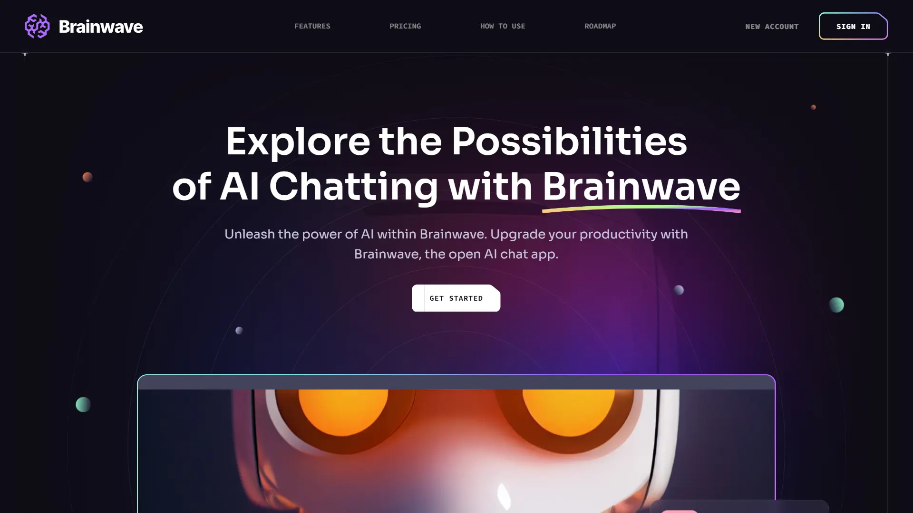

<div align="center">
    <a href="https://brainwave-fv.netlify.app/" target="_blank">
      
    </a>
  <h3 align="center">Brainwave UI Design</h3>
</div>

##  <br /> 📋 <a name="table">Table of Contents</a>

- ✨ [Introduction](#introduction)
- ⚙️ [Tech Stack](#tech-stack)
- 📝 [Features](#features)
- 🚀 [Quick Start](#quick-start)

##  <br /> <a name="introduction">✨ Introduction</a>

**[EN]** 
Brainwave is a modern UI/UX website built using React.js and Tailwind CSS, designed with contemporary principles in mind. It features smooth parallax effects and bento box layouts, offering a stylish UI that adapts well from desktop to mobile devices. With polished animations and a user-friendly experience, Brainwave sets a high standard while providing inspiration for modern applications and websites.

**[FR]** Brainwave est un site web UI/UX moderne créé avec React.js et Tailwind CSS, qui incarne les principes actuels du design. Il présente des effets de parallaxe fluides et des mises en page bento box, offrant une interface élégante adaptée aussi bien aux ordinateurs de bureau qu'aux appareils mobiles. Avec des animations soignées et une expérience utilisateur exceptionnelle, Brainwave se distingue comme une source d'inspiration pour les applications et sites web contemporains.

##  <br /> <a name="tech-stack">⚙️ Tech Stack</a>

- **React** is a popular JavaScript library for building user interfaces, particularly single-page applications where data changes over time. React's component-based architecture allows developers to create reusable UI components, making development more efficient and the codebase easier to maintain. Its virtual DOM enhances performance by minimizing direct interactions with the browser's DOM.

- **Vite** is a modern frontend build tool known for fast ES Module imports, efficient bundling, and quick development server startup times. It supports frameworks like Vue.js and React, optimizing workflow and performance compared to traditional bundlers.

- **Tailwind** is a utility-first CSS framework that speeds up UI development by providing a set of pre-built utility classes. It allows developers to quickly build custom designs without writing traditional CSS, promoting rapid prototyping and design consistency.


## <br/> <a name="features">📝 Features</a>

👉 **Beautiful Sections**: Includes hero, services, features, how to use, roadmap, pricing, footer, and header.

👉 **Parallax Animations**: Engaging effects triggered by mouse movement and scrolling.

👉 **Complex UI Geometry**: Utilizes tailwindcss for intricate shapes like circular feature displays, grid lines, and side lines.

👉 **Latest UI Trends**: Incorporates modern design elements such as bento grids.

👉 **Cool Gradients**: Enhances visuals with stylish gradients using Tailwind CSS for cards, buttons, etc.

👉 **Responsive**: Ensures seamless functionality and aesthetics across all devices.


## <br /> <a name="quick-start">🚀 Quick Start</a>

Follow these steps to set up the project locally on your machine.

<br/>**Prerequisites**

Make sure you have the following installed on your machine:

- [Git](https://git-scm.com/)
- [Node.js](https://nodejs.org/en)
- [npm](https://www.npmjs.com/) (Node Package Manager)

<br/>**Cloning the Repository**

```bash
git clone {git remote URL}
```

<br/>**Installation**

Let's install the project dependencies, from your terminal, run:

```bash
npm install
# or
yarn install
```

<br/>**Running the Project**

Installation will take a minute or two, but once that's done, you should be able to run the following command:

```bash
npm run dev
# or
yarn dev
```

Open [`http://localhost:3000`](http://localhost:3000) in your browser to view the project.